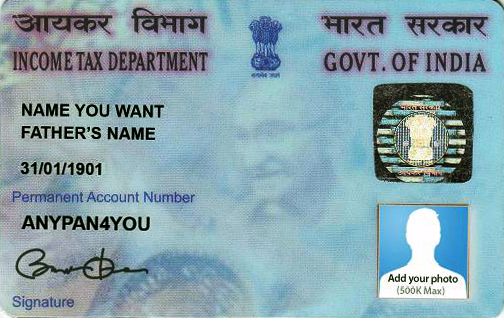

<h1>OCR using YOLO and Py-Tesseract</h1>  

Optical Character Recognition (OCR) is used to convert scanned
images to text. Building a OCR requires regions of an image detection.
These detections are such that the selective text from the original
image can be obtained. Thus, after the text is detected, its recognition
is required.    
Test Detection consists of finding the bounding box and classifying it.
YOLO predicts both the boundary box and the class at the same time.
It is much faster but there is a tradeoff between speed and accuracy.
However, it has good enough accuracy for the application of PAN Card
OCR.    
After text detection, Py-tesseract (Python-tesseract) or Tesseract OCR
can be used as an open-source text recognizer. The difference
between two is that the OCR wrappers for Python-tesseract is based
on Googles OCR API while Tesseract OCR isn't.     

 

1. Using Vott for data tagging and labeling.    
2. Converting the labelled data to Yolo v3 Format.    
3. Done training on Darkent framework, with mean average precision as stopping criteria (-map flag).     
The google notebook file for darknet training is attached herein in /OCR_for_PanCards/DarknetModel/YOLOv3.ipynb

```bash
	$ darknet.exe detector train data/obj.data yolo-obj.cfg "last_executed" -map
```
This has provided with, best weights based on MAP score- 10,000 is that iteration number for my data set.    
   
The weight file is provided as yolov3_custom_best_10000.weights. The google drive link to file is shared.    

Link: https://drive.google.com/open?id=1r3xue0pzWaiwODLKXDmE2bGdz42e78vx

OCR wrappers for Python- pytesseract is based on Googles OCR API and tesseract isn't. I would suggest using pytesseract based on the fact that it will be maintained better, but with that being said, try them both out and use whichever works better for you. 

I have used both OCR wrapers i.e. Tesseract and Py-tesseract and python code files are provided in /OCR_for_PanCards/PAN_OCR/MainWithPytesseract.py & /OCR_for_PanCards/PAN_OCR/MainWithTesseract.py respectively.    

    
The above image will be cropped and conveted as:    
    
    
    
    
4. To run the above main.py files, follow the instructions-

Using python3 and py-tesseract for python3.
Clone the repo and then,

Run following command in /OCR_for_PanCards/PAN_OCR/
```bash
$ bash ./darknet.sh

$ python3 MainWithPytesseract.py -d -t --weights yolov3_custom_best_10000.weights
```

Keep your images at /OCR_for_PanCards/PAN_OCR/pancards folder and see the csv file at /OCR_for_PanCards/PAN_OCR/output folder.
 


Goto [Documentation](https://github.com/sourabh-suri/Pan-Card-OCR/blob/master/Report.pdf) for all details.....
  
## Development  
Want to contribute? **:pencil:**  
  
To fix a bug or enhance an existing module, follow these steps:  
  
1. Fork the repo
2. Create a new branch (`git checkout -b exciting-stuff`)
3. Make the appropriate changes in the files
4. Add changes to reflect the changes made
5. Commit your changes (`git commit -am 'exciting-stuff!!'`)
6. Push to the branch (`git push origin exciting-stuff`)
7. Create a Pull Request
  
  
## Interested?  
If you find a bug (the app couldn't handle the query and / or gave irrelevant results), kindly open an issue [here](https://github.com/sourabh-suri/Pan-Card-OCR/issues/new) by including your search query and the expected result.  
  
If you'd like to request a new functionality, feel free to do so by opening an issue [here](https://github.com/sourabh-suri/Pan-Card-OCR/issues/new) including some sample queries and their corresponding results.
  
